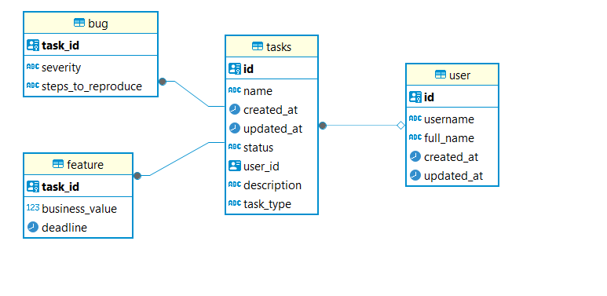

steps to run application:
1. download and then install jdk 21: https://www.oracle.com/vn/java/technologies/downloads/#java21
2. add java home environment variable
3. download maven and set maven home environment variable
4. install docker and docker compose
5. go to project common and then type command in terminal: mvn clean install
6. go to project task-management and then type command in terminal: mvn clean install
7. in project task-management, run docker-compose in docker-compose folder
8. after run docker-compose, postgres sql server is created, then go to postgres server then create task-management schema
9. run task-management application

A brief explanation of your design and approach:
1. module design:  I have created two services that are: task-management and common
 1.1: common module is used for common configuration like kafka, redis, etc.. that are used for other services
 1.2: task-management will import library from common service
 and in the future, If I create a new service, It also will import from common service
2. database design:

I create 4 tables: bug, feature, tasks, user.
task_id of bug, feature tables are a foreign key of tasks' id.
user_id of task table is a foreign key of user's id table 

2. package structure:
    flow: controller -> applicationservice -> service -> repository -> entity
    mapper package: I use mapstruct to map request to entity
    So I think my package structure is familiar with most dev, so I will not go to detail about this.
3. code design
After reading the requirement, I see that a task can be a feature or bug, and they have its own specific fields
I have two approach for this:
the first one is : 
    add one attribute additionalInfo with JsonB datatype. So with that additionalInfo we can contain more information in there without adding a new field in the future
    but the drawback is: It's hard to filter, search data in there.
the second one is:
    It will be like database deign above.
    I have used factory design pattern for creating a bug task or feature task
    And with this design, It easier to search and filter attributes

for my take, I choose the second one.

4. junit test, integration test:
In this project, I have written junit test, integration test in /src/test folder

